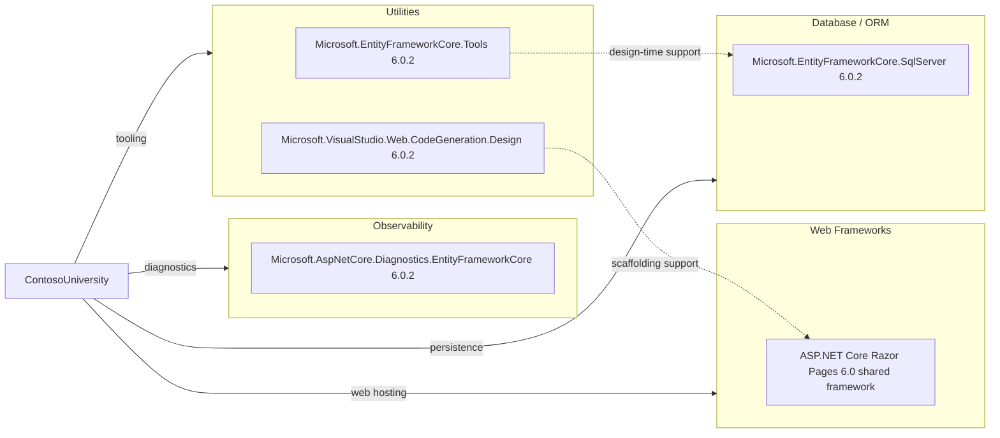

# Dependency Map

ContosoUniversity declares four direct NuGet package references in its project file and depends on the ASP.NET Core shared framework brought in by `Microsoft.NET.Sdk.Web`. The dependency set is small and focused on server-rendered web hosting, EF Core data access, and local scaffolding support.

## Dependencies

### Dependency Summary

| Category | Count | Key Libraries | Notes |
| --- | --- | --- | --- |
| Web Frameworks | 1 | ASP.NET Core Razor Pages 6.0 shared framework | Provided implicitly by `Microsoft.NET.Sdk.Web` rather than as an explicit package reference |
| Database / ORM | 1 | `Microsoft.EntityFrameworkCore.SqlServer` 6.0.2 | Supplies the EF Core provider used by `SchoolContext` |
| Observability | 1 | `Microsoft.AspNetCore.Diagnostics.EntityFrameworkCore` 6.0.2 | Enables detailed EF-related developer exception pages during development |
| Utilities | 2 | `Microsoft.EntityFrameworkCore.Tools` 6.0.2, `Microsoft.VisualStudio.Web.CodeGeneration.Design` 6.0.2 | Design-time tooling for migrations and scaffolding |

### Version & Compatibility Risks

The most notable compatibility risk is the application target framework rather than the package list: the project targets `net6.0`, which is out of support. The EF Core and scaffolding packages are aligned to 6.0.2, so future modernization work will likely center on moving the runtime and shared framework forward before making large platform changes.

### Notable Observations

- The runtime dependency footprint is intentionally small; there are no declared messaging, caching, authentication, or telemetry libraries.
- EF Core tooling is marked with `PrivateAssets=all`, keeping design-time packages from flowing transitively into downstream consumers.
- The project relies on the shared ASP.NET Core web framework from the SDK, so part of the web stack is implicit rather than fully expressed in `PackageReference` entries.
- The SQL Server provider is the only direct persistence dependency, which simplifies database-related migration analysis.
