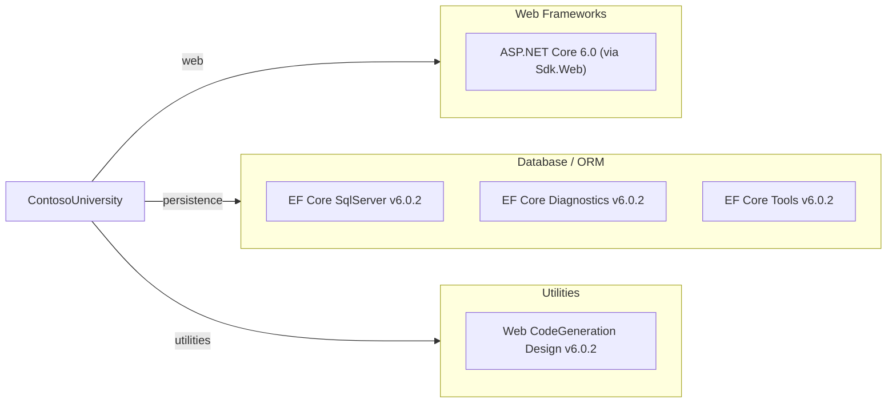

# Dependency Map

ContosoUniversity is an ASP.NET Core 6.0 web application with 4 declared external NuGet dependencies centered on Entity Framework Core and SQL Server.

## Dependencies

```mermaid
flowchart LR
    App["ContosoUniversity"]

    subgraph Web["Web Frameworks"]
        ASPNET["ASP.NET Core 6.0 (via Sdk.Web)"]
    end
    subgraph DB["Database / ORM"]
        EFSqlServer["EF Core SqlServer v6.0.2"]
        EFDiag["EF Core Diagnostics v6.0.2"]
        EFTools["EF Core Tools v6.0.2"]
    end
    subgraph Util["Utilities"]
        CodeGen["Web CodeGeneration Design v6.0.2"]
    end

    App -->|"web"| Web
    App -->|"persistence"| DB
    App -->|"utilities"| Util
```
