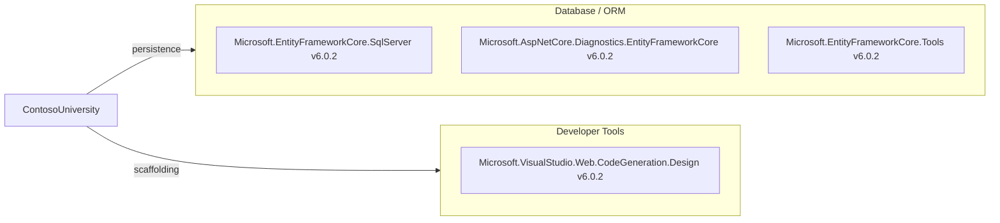

# Dependency Map

ContosoUniversity is an ASP.NET Core 6.0 application with 4 declared external NuGet dependencies.

## Dependencies

```mermaid
flowchart LR
    App["ContosoUniversity"]

    subgraph DB["Database / ORM"]
        EFSqlServer["Microsoft.EntityFrameworkCore.SqlServer v6.0.2"]
        EFDiagnostics["Microsoft.AspNetCore.Diagnostics.EntityFrameworkCore v6.0.2"]
        EFTools["Microsoft.EntityFrameworkCore.Tools v6.0.2"]
    end
    subgraph Dev["Developer Tools"]
        CodeGen["Microsoft.VisualStudio.Web.CodeGeneration.Design v6.0.2"]
    end

    App -->|"persistence"| DB
    App -->|"scaffolding"| Dev
```
