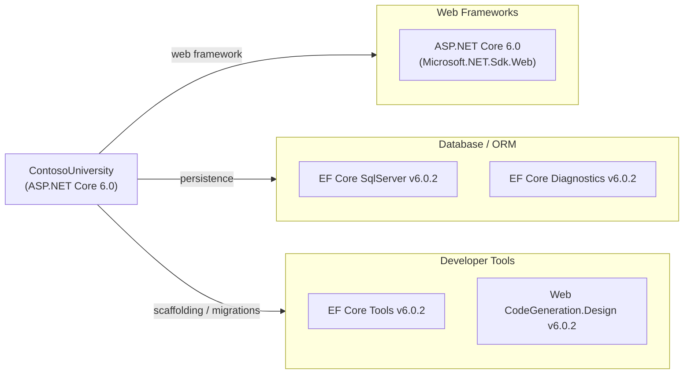

# Dependency Map

ContosoUniversity declares 4 external NuGet packages built on top of the ASP.NET Core 6.0 web framework (included via the Microsoft.NET.Sdk.Web SDK).

## Dependencies

```mermaid
flowchart LR
    App["ContosoUniversity\n(ASP.NET Core 6.0)"]

    subgraph Web["Web Frameworks"]
        ASPNET["ASP.NET Core 6.0\n(Microsoft.NET.Sdk.Web)"]
    end
    subgraph DB["Database / ORM"]
        EFSqlServer["EF Core SqlServer v6.0.2"]
        EFDiag["EF Core Diagnostics v6.0.2"]
    end
    subgraph DevTools["Developer Tools"]
        EFTools["EF Core Tools v6.0.2"]
        CodeGen["Web CodeGeneration.Design v6.0.2"]
    end

    App -->|"web framework"| Web
    App -->|"persistence"| DB
    App -->|"scaffolding / migrations"| DevTools
```
